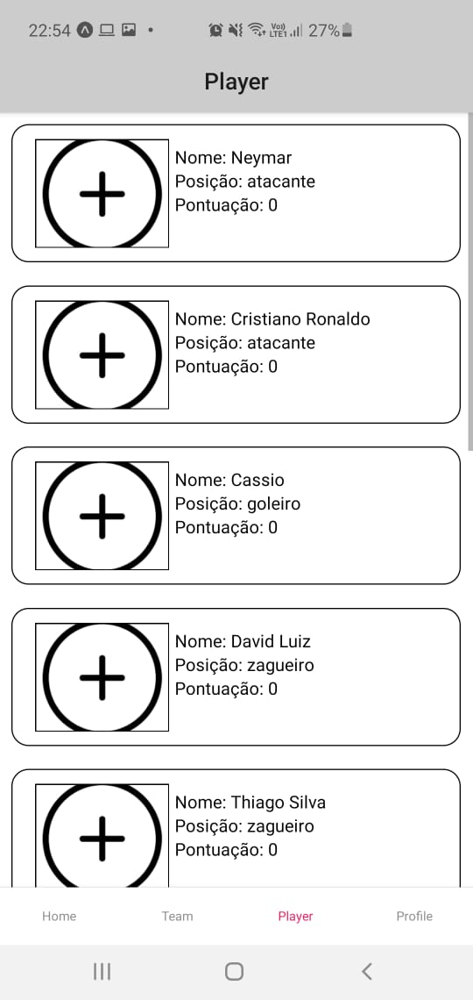

<h1 align="center">
Cartoleiros
</h1>
<h2 align="center">
App Preview 
</h2>  

  
  
  
  
  
  
  

  

  
	
  

  

  

  

  <a href="#rocket-Technologies">Technologies</a>&nbsp;&nbsp;&nbsp;|&nbsp;&nbsp;&nbsp;
  <a href="#-project">Project</a>&nbsp;&nbsp;&nbsp;|&nbsp;&nbsp;&nbsp;
  <a href="#-how-to-contribute">How to contribute</a>&nbsp;&nbsp;&nbsp;|&nbsp;&nbsp;&nbsp;
  <a href="#memo-license">License</a>

 

## 🚀 Technologies

This project was developed with the following technologies:

- [Node.js](https://nodejs.org/en/) 
- [React Native](https://reactnative.dev/)

## 💻 Project

Cartoleiros is a personal project developed for learning new features and apply my knowledge in something real. 

## 🤔 How to contribute

- Make a fork;
- Create a branck with your feature: `git checkout -b my-feature`;
- Commit changes: `git commit -m 'feat: My new feature'`;
- Make a push to your branch: `git push origin my-feature`.

After merging your receipt request to done, you can delete a branch from yours.

## 📝 License

This project is under the MIT license. See the [LICENSE](LICENSE.md) for details.

---

Made by André Macena :wave: [Get in touch!](https://www.linkedin.com/in/andr%C3%A9-macena-15275b12b/)